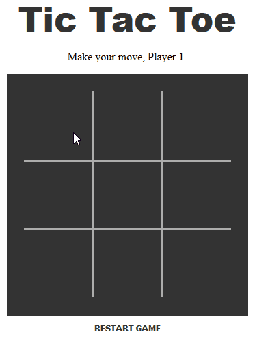

A simple 2-player Tic-Tac-Toe game on a 3x3 grid. 

Technologies used: HTML, CSS, JavaScript

This took me around 10 hours over the course of 4 days to code from scratch (according to WakaTime). I kept the HTML and CSS pretty concise since most of the action happens in the JavaScript. I think what accounted for most of those hours was me just staring blankly at an array of possible win conditions and not knowing what to do with them. The biggest challenge for me was figuring out how to compare arrays to check for winning plays. Thankfully, StackOverflow guided me to the `every()` method. But just as I got it working for several made-up test cases, it would not work for the game array I created with the cell IDs. After sleeping on the problem, I realized that it was made up of strings, not integers, thus needed parsing. A real forehead smack moment. Anyway, here are the steps I took to code the JS portion (maybe this'll help someone create their own tic-tac-toe game in the future): 

1. create an array of possible win combos
2. create player objects
3. mark the board up with x's onclick
4. display message based on game status (whose turn, someone won, or issa tie)
5. alternate x's and o's (take turns)
6. add a button that resets the board
7. check game status/check if (game === won)
8. get array of x's (or o's) on board
9. compare to winning combos
10. if win, removeeventlistener and add quirky css features
11. display message "sub zero wins" restart button now says "play again?"
12. press restart: remove added styles and reset original text
13. figure out if it's a tie (check empty squares by counting)
14. clean up code
15. have fun! (find a friend first bc playing tic-tac-toe by yourself is boring.)
